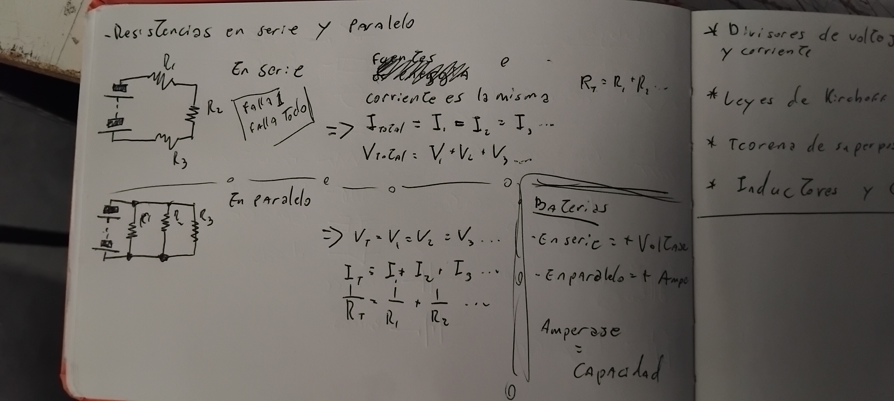
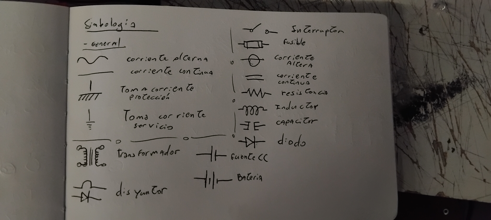
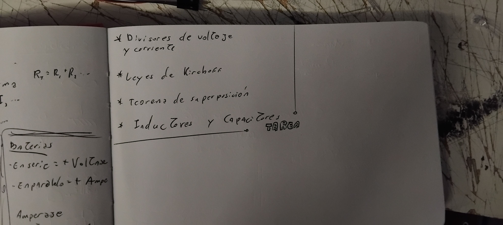
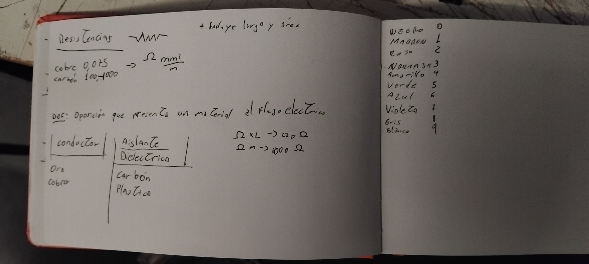
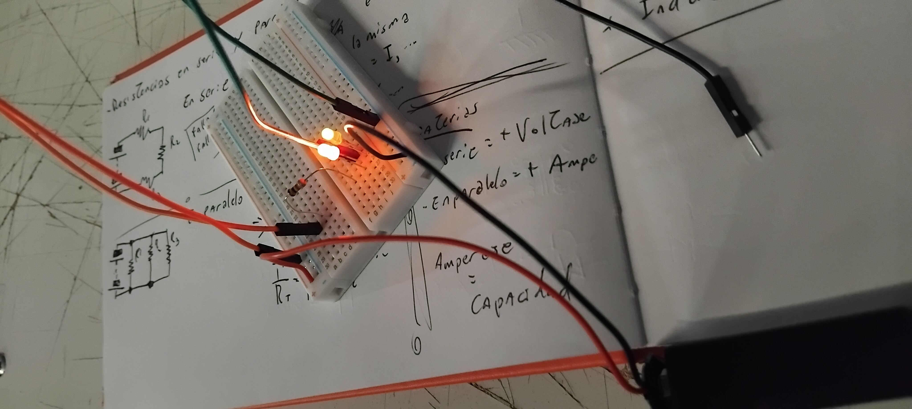

# sesion-02a

## Titulo 2 ##

### Esquemático 1 ##

|  | D1 | D2 | D3 | D4 |
| - | - | - | - | - |
| R1 | 0 | 0 | 0 | 0 |
| R2 | 0 | 0 | 0 | 1 |
| R3 | 1 | 1 | 1 | 0 |
| R4 | 1 | 1 | 1 | 0 |
| R5 | 1 | 0 | 0 | 1 |

 

## Esquemático 2 ## 

|  | D1 | D2 | D3 |
| - | - | - | - | 
| R1 | 1 | 0 | 1 | 
| R2 | 1 | 0 | 1 | 
| R3 | 1 | 0 | 1 | 
| R4 | 1 | 0 | 1 | 
| R5 | 0 | 1 | 1 | 
| R6 | 1 | 1 | 1 | 
| R7 | 1 | 1 | 1 | 
| R8 | 1 | 1 | 0 | 

 

## Esquemático 3 ##

|  | D1 | D2 | D3 | D4 |
| - | - | - | - | - |
| R1 | 1 | 1 | 1 | 1 |
| R2 | 1 | 1 | 1 | 1 |
| R3 | 1 | 1 | 1 | 1 |
| R4 | 1 | 0 | 1 | 1 |
| R5 | 1 | 1 | 1 | 1 |
| R6 | 1 | 1 | 1 | 1 |

 

